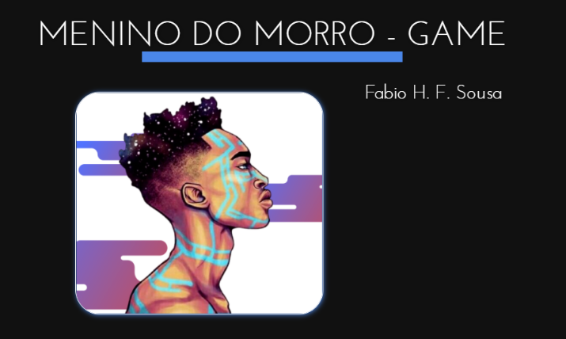

# MENINO DO MORRO - GAME

(Meu projeto do Módulo I - IronHack)
 

Clique [aqui](https://henriquefb08.github.io/menino_do_morro_project/) para jogar **Menino do Morro - Game**  :boom:
Slides - clique [aqui](https://slides.com/fabiohfsousa/meninodomorro_game/fullscreen) para ver apresentação do projeto

---

## Introdução

**Menino do Morro - Game** :stuck_out_tongue_winking_eye:  é um jogo que foi criado com o intuito de aplicar meus conhecimentos em desenvolvimento web. O jogo tem como objetivo apresentar os desafios que o jovem da periferia enfrenta durante sua vida. O jogo tem ícones negativos representados pela criminalidade desigualdade e preconceito. E ícones positivos que são representados por estudos e cashs.

---

## Controle de movimentação

- W, A, S, D
- Arrow Keys: :arrow_left:, :arrow_up:, :arrow_right:, :arrow_down:

---

## Features

- ìcones coletáveis dando pontos positívos ou negativos
- Movimentação do personagem
- Música (Levanta e Anda do Emicida
- Tom dos ícones coletados
- Movimentação do cenário
- Game Over e Vitória
- Pushs de mensagens motivacionais
- Contagem de score

---
 
